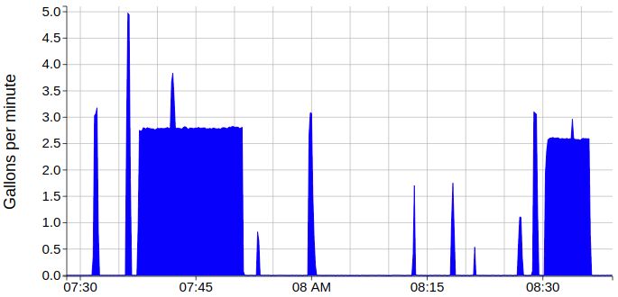

# Joel's water meter project

The idea is to measure the water usage of our house, at a pretty fine grain,
so we can disaggregate.  Our city meter is a fancy ultrasonic one, so rather
than deal with that, I added another meter in series with the city meter.
