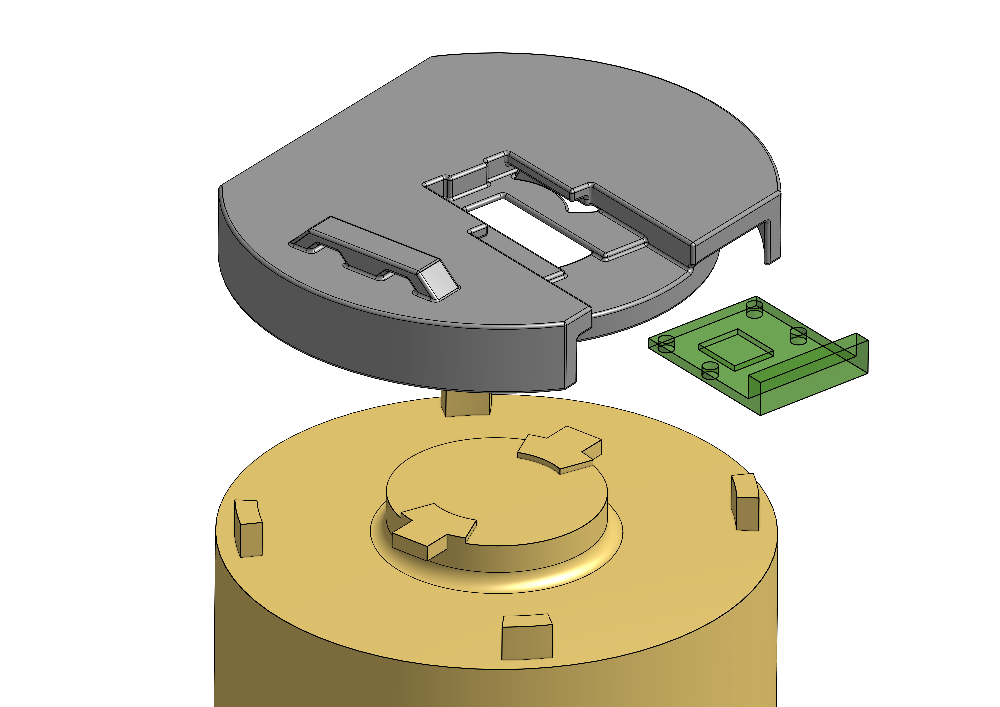

# Hardware

To measure the water flow, I used the
[Neptune T-10 mechanical meter,](https://www.neptunetg.com/globalassets/products/literature/20-004231-ps-t-10-small-02.20.pdf)

The T-10 is a
[nutating disc](https://en.wikipedia.org/wiki/Nutating_disc_engine#Water_meters)
design with a magnetic interface to the register, the most common design of
mechanical meter, about 150 years old.  It's very popular (though less now,
with the advent of ultrasonic meters), rated (and certified by the state
of California) 95% accurate down to 0.125 gpm,
it's been around forever, made in the USA,
it's lead-free, NSF 61 certified (and cast into the body),
and it's easy to 
[buy new on ebay, for about $60.](https://www.ebay.com/itm/Neptune-5-8x3-4-Water-Meter-T-10-Trident-NSF61-Direct-Read-Cubic-Feet-qty-avail/264510110592)
I was concerned that the nutating
disc type would make a ticking sound, but it doesn't seem to, at least not that
I can hear.

For plumbing, I also need couplers, which use rubber gaskets, 
[available locally at home depot for about $20 each,](https://www.homedepot.com/p/Everbilt-3-4-in-FIP-x-1-in-MIP-Brass-Adapter-Fitting-801829/300096110)
which seems high, but whatever.

I also need copper fittings, 
[about $4 each at home depot.](https://www.homedepot.com/p/Everbilt-3-4-in-Copper-Pressure-Cup-x-FIP-Female-Adapter-Fitting-C603HD34/100347144)

The T-10 comes with a "direct read" mechanical odometer-style register, which
is easily removable.
I replaced the mechanical register with a magnetometer with a SPI interface.
There are many to choose from, manufactured by AMS.  I chose the
[AS5048](https://ams.com/documents/20143/36005/AS5048_DS000298_4-00.pdf)
because it's available in a
[little breakout board](https://ams.com/documents/20143/36005/AS5048_UG000223_1-00.pdf)
which is available from
[Mouser for about $16](https://www.mouser.com/ProductDetail/ams/AS5048A-TS_EK_AB?qs=Rt6VE0PE%2FOd5D%2Fkw9O7ofA%3D%3D)

To mount the board to the meter, I designed 
[an adapter](https://cad.onshape.com/documents/ed2b755e4b344f41f9b4f153/w/52855fbdfec80d94d3c574bc/e/c719515288ca89ce0e0c505f)
suitable for 3d printing:

The mount puts the sensor chip against the bronze surface of the meter body,
which I covered with electrical tape.  Even so, the magnetic signal isn't
as high as the sensor wants: it complains, using the "comp_high" signal, which 
indicates that the front end amplifier is at maximum gain, and it reports a
"magnitude" of about 400, which is only 10% of the magnitude of
[the little demo knob.](https://ams.com/rmh05-dk-xx)
The AS5048 doc claims that out-of-range fields can be ok:

> However, a magnetic field outside the specified range may still
produce usable results, but the out-of-range condition will be
indicated by indication flags.

In practice, the angle seems to be reported reliably even though the magnitude
is low.  Maybe the effect of the
low magnitude is in the noise of the output, which seems high (see below),
but still totally usable.

To read the SPI interface, I used a Raspberry Pi 4 model B with 2GB of memory,
[available for about $35 from Adafruit.](https://www.adafruit.com/product/4295?src=raspberrypi)

I soldered cat-5 cable to the AMS board, and on the pi end, I used
a 
[screw terminal hat,](https://alchemy-power.com/pi-ezconnect/)
([datasheet](https://www.alchemy-power.com/wp-content/uploads/2017/03/Pi-EzConnect.pdf))
available at
[Adafruit for about $20.](https://www.adafruit.com/product/2711)

I also covered the board in several coats of conformal coating, after soldering.

The cable is quite long, maybe 50 feet, so I was concerned about the health of
the SPI protocol.  I tested it at 1Mhz, and it worked but produced parity errors every
ten seconds or so.  Going slower seems to work fine.

So the total cost of the project is about $180.

## Meter Installation

I found some
[guidelines](http://scceh.com/Portals/6/Env_Health/consumer_protection/drinking_water/Meter_Tech_Stds.pdf)
for meter installation that seem useful.

The conventional thing is apparently to dig quite a deep pit, so the meter is
18 inches below ground level, protected from freezing, with 6-12 inches of
pea gravel below the meter.  Perhaps these guidelines are for colder climates;
the city meter is nowhere near 18 inches below ground, it's more like 8 inches.

I looked into the meter thread, which are 
[unusual.](https://utility-technologies.myshopify.com/pages/water-meter-terminology)
It's "AWWA" (American Water Works Association) which is one-inch "NPSM"
(National Pipe Straight Mechanical).

The length between flanges is 7.5 inches, so with 1/8 clearance for gaskets on each end,
7.75, maybe a bit more?

It would be nice to have a bypass pipe, called an "idler," handy in case something
goes wrong, for example
[this one,](https://www.flows.com/plastic-spacer-tube-for-3-4-meter/) or
[this one](https://assets.fordmeterbox.com/pricebook/h/Water-Meter-Coupling-Price-Book.pdf)
(if only they sold direct),
or I could just make one out of PVC NPT fittings, which will probably
work well enough to seal against the soft rubber gasket.

I carefully cut the pipe, sweated on some fittings, and installed the meter:

## Wiring

SPI isn't really 
[intended](https://electronics.stackexchange.com/questions/163468/spi-max-distance)
for the 50-foot run I'm using, but it seems fine if it runs slowly enough.

I used four-pair ethernet cable, wired as follows to the RPi GPIO, so that
the clk and data lines are paired with vcc or gnd.

| SPI  | Cable        | GPIO                     |
| ---- | ------------ | ------------------------ |
| 5V   | Orange       | 3.3V (upper left)        |
| 3.3V | Green        | 3.3V (upper left)        |
| PWM  | Brown        | N/C                      |
| CS   | White/Brown  | P24 (near center bottom) |
| SCK  | Blue         | P23 (upper center)       |
| MOSI | White/Green  | P19 (upper center)       |
| MISO | White/Orange | P21 (upper center)       |
| GND  | White/Blue   | GND (center bottom)      |

Here's the RPi screwed to the ceiling of the garage:

